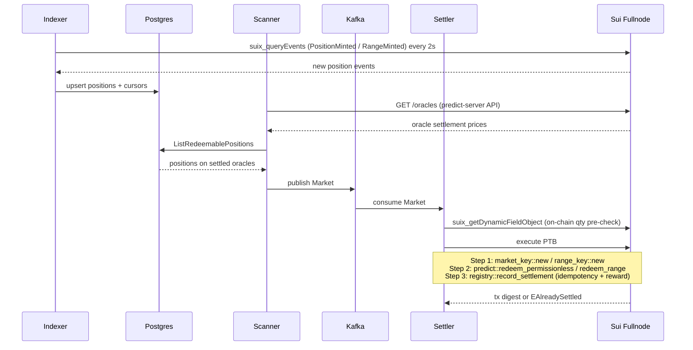

# Pharos — Keeper Network for DeepBook Predict

An open, permissionless keeper network on Sui that settles expired DeepBook Predict positions on-chain and pays operators a SUI reward for every successful settlement.

---

## Problem

DeepBook Predict markets expire passively. When a market expires, someone must submit an on-chain transaction to redeem positions and pay out the winning traders. Without an external trigger, positions sit unredeemed indefinitely. The protocol has no built-in automation — it relies on external actors called keepers to do this work.

Running a keeper was previously a private affair: one operator, one bot, no coordination, no reward mechanism. Any collision between two keepers attempting to settle the same position would result in one wasted transaction with no fallback.

## Solution

Pharos is an open keeper network built on top of a custom Move registry deployed to Sui Testnet. Any wallet can bond 1 SUI, receive a `KeeperCredential` on-chain, and run a keeper node that earns 0.1 SUI per settled position. The on-chain registry enforces a first-writer-wins rule: only the first keeper to record a settlement is paid; subsequent attempts abort gracefully with `EAlreadySettled` and the off-chain node moves on.

The keeper node itself is a Go service that indexes position events from the Sui fullnode, checks oracle settlement status, and submits 3-step Programmable Transaction Blocks (PTBs) that atomically redeem a position and record the settlement in the registry.

## Demo

- **Live dashboard**: https://pharos-livid.vercel.app/
- **Registry on SuiScan**: https://suiscan.xyz/testnet/object/0x30e72c2997fca9986a8e8db2b9fedf50ce199a508534241cf4ae4e11712b47c9

## How It Works

### Settlement flow



### PTB atomicity guarantee

The Move registry does **not** call `redeem_permissionless` itself — there is no cross-package dependency. Instead, the keeper builds a single PTB where step 2 is the DeepBook Predict redemption and step 3 is the registry record. PTB execution is atomic: step 3 only runs if step 2 succeeded. A keeper cannot claim a reward without a real redemption in the same transaction.

### Race safety

The registry stores a `Table<SettlementKey, address>` (binary) and `Table<RangeSettlementKey, address>` (range). On `record_settlement`, it asserts `!table.contains(key)` and aborts with `EAlreadySettled` (code 0) if another keeper already wrote this key. The off-chain node treats this abort as a graceful race loss, not an error.

## Architecture

```
keeper/
├── cmd/main.go              # wires all components, reads env
├── internal/
│   ├── engine/              # orchestrates goroutines: indexer, scanner→queue, settler, reaper
│   ├── indexer/             # polls suix_queryEvents for PositionMinted + RangeMinted, upserts to DB
│   ├── scanner/             # reads settled oracles, queries DB, emits redeemable markets
│   ├── queue/               # Kafka producer/consumer (topic: markets.redeemable)
│   ├── settler/             # worker pool (n=5), calls Protocol.Settle per market
│   ├── store/               # Postgres via pgx/v5 — positions, cursors, in-flight claims, reaper
│   ├── protocols/deepbook/  # builds and executes settlement PTBs, on-chain qty pre-checks
│   └── errors/              # sentinel errors: ErrAlreadySettled, ErrAlreadyRedeemed, ErrInsufficientGas
├── move/
│   └── sources/
│       ├── registry.move    # shared Registry — settlement tables, treasury, reward logic
│       ├── credential.move  # KeeperCredential — bond, activation, job counter
│       └── tip_registry.move # tip preference storage (v1 scaffolding, not yet enforced)
├── dashboard/               # React + Vite frontend — live stats, settlement feed, join flow
├── scripts/                 # TypeScript helper scripts (demo-mint, list-markets)
├── docker-compose.yml       # keeper + postgres:16-alpine + apache/kafka
├── Dockerfile               # Go binary build
└── setup.sh                 # interactive setup wizard (3 prompts → writes .env → docker compose up)
```

## Tech Stack

**On-chain (Move)**
- Move 2024 (`edition = "2024.beta"`)
- Sui framework: `sui::table`, `sui::balance`, `sui::coin`, `sui::event`, `sui::clock`
- No external Move dependencies — PTB atomicity replaces the need to import DeepBook Predict

**Keeper node (Go)**
- Go 1.25
- `github.com/block-vision/sui-go-sdk v1.2.1` — Sui RPC client, PTB builder, signer
- `github.com/jackc/pgx/v5` — Postgres driver
- `github.com/segmentio/kafka-go` — Kafka producer/consumer
- `github.com/joho/godotenv` — `.env` loading

**Dashboard (React)**
- Vite 5 + React 18 + TypeScript 5
- `@mysten/dapp-kit ^0.14.0` — wallet connection, `useSuiClientQuery`
- `@mysten/sui 1.24.0` — PTB construction for the bond transaction
- `@tanstack/react-query ^5` — server state management

**Infrastructure**
- Docker Compose: `keeper` service + `postgres:16-alpine` + `apache/kafka:latest`
- Vercel (dashboard static hosting)

## Getting Started

### Prerequisites

- Docker Desktop 4+
- A Sui wallet with testnet SUI ([faucet](https://faucet.sui.io))
- A `KeeperCredential` — bond 1 SUI via the dashboard's "Run a Pharos Keeper" flow

### Quickstart

```bash
git clone https://github.com/cosmatudor/Pharos-Sui-Overflow-2026
cd Pharos-Sui-Overflow-2026/keeper
./setup.sh
```

`setup.sh` asks three questions (network, private key, credential ID), writes `.env`, and runs `docker compose up -d --build`.

```bash
# Watch live settlement logs
docker compose logs -f keeper

# Stop
docker compose down

# Full reset (wipes DB + Kafka state)
docker compose down -v && docker compose up -d --build
```

### Dashboard (local dev)

```bash
cd dashboard
npm install
npm run dev
```

### Build keeper binary

```bash
go build ./cmd/...
```

## Move Modules

**Network**: Sui Testnet

**Package ID**: `0xba7e6347effb2675abe6be5878d16b2b164fb8568ff026a84fdfd16a1fda6231`

**Registry shared object**: `0x30e72c2997fca9986a8e8db2b9fedf50ce199a508534241cf4ae4e11712b47c9`

### `registry.move`

| Function | Description |
|---|---|
| `record_settlement` | Asserts credential active + position not already settled, records keeper, pays treasury reward |
| `record_range_settlement` | Same for range positions |
| `fund_treasury` | Anyone can top up the SUI reward pool |
| `set_reward` | Admin: update reward per settlement (MIST) |
| `withdraw_treasury` | Admin: reclaim treasury funds |

Errors: `EAlreadySettled` (0), `EInsufficientTreasury` (1). Default reward: 0.1 SUI (`100_000_000` MIST).

### `credential.move`

| Function | Description |
|---|---|
| `register` | Bond ≥1 SUI, receive a `KeeperCredential` owned object. Emits `KeeperRegistered`. |
| `unbond` | Return bonded SUI and destroy the credential |

`ACTIVATION_DELAY_MS = 0` on testnet (instant activation). Set to `259_200_000` (3 days in ms) before mainnet deploy.

### `tip_registry.move`

Stores per-manager opt-in/opt-out tip preferences on-chain. **V1 scaffolding** — preferences are stored and readable but not enforced during settlement. Enforcement requires `redeem_permissionless_with_tip` from Mysten, which does not exist yet.

## What's Built vs. What's Not

| Feature | Status |
|---|---|
| On-chain registry with race-safe settlement | ✅ Deployed on testnet |
| Binary position settlement (PTB) | ✅ Working |
| Range position settlement (PTB) | ✅ Working |
| KeeperCredential bond / unbond | ✅ Working |
| Event-driven indexer (PositionMinted + RangeMinted) | ✅ Working |
| Kafka-backed settler worker pool (concurrency=5) | ✅ Working |
| Stale claim reaper (crashed keeper recovery) | ✅ Working |
| On-chain qty pre-check (avoids wasted gas) | ✅ Working |
| Live dashboard — stats, settlement feed, keeper table | ✅ Working |
| Dashboard join flow (wallet → bond → credential) | ✅ Working |
| Treasury rewards (0.1 SUI per settlement) | ✅ Working |
| Tip registry preference storage | ✅ Deployed, not enforced |
| Tip enforcement on settlement | 📋 Blocked on Mysten adding `redeem_permissionless_with_tip` |
| MEV-resistant submission | 📋 Not implemented |
| Mainnet activation delay (3-day bond lockup) | 📋 Constant is 0 for testnet; needs flip before mainnet |
| Tests (unit or integration) | 📋 Not written |

## Sui Overflow 2026

**Track**: DeFi / Infrastructure

**What's novel for the Sui ecosystem**: DeepBook Predict exposes `redeem_permissionless` but ships no coordination layer for external operators. Without one, there is no Sybil resistance, no reward mechanism, and no graceful collision handling between competing bots. Pharos adds this coordination layer without modifying the DeepBook Predict contracts. The key insight is that Sui PTB atomicity can serve as the enforcement primitive: the registry doesn't need to import or call DeepBook — it simply asserts its own state is consistent, and the PTB builder ensures that assertion only runs after a real redemption in the same transaction.

**Honest scope statement**: Within the hackathon timeframe we shipped a working testnet deployment with multiple keeper nodes earning real on-chain rewards, a live dashboard, and a self-service onboarding flow. What we didn't finish: tests, MEV-resistant submission, and tip enforcement (the last of which is also blocked on a Mysten protocol change). The tip registry and mainnet activation delay are present in code but not active in the testnet deployment.

## Future Work

1. **Tip enforcement** — integrate `redeem_permissionless_with_tip` once Mysten ships it; wire `TipRegistry.effective_tip_bps()` into the settlement PTB
2. **Mainnet readiness** — flip `ACTIVATION_DELAY_MS` to `259_200_000` and audit bond economics for mainnet gas costs
3. **Tests** — Move unit tests for `registry.move` and `credential.move`; Go tests for PTB construction and abort-code classification
4. **MEV resistance** — private RPC endpoint or commit-reveal scheme to reduce frontrunning on high-value settlements
5. **Multi-asset** — PTB type tag is currently hardcoded to dUSDC; parameterize for other DeepBook Predict quote currencies
6. **Keeper leaderboard** — `jobs_completed` is tracked on-chain; surface it more prominently in the dashboard
7. **Mainnet deployment** — update package IDs, fund treasury, run extended soak test before going live

## License

MIT — add a `LICENSE` file to the repo if you want this to be enforceable.